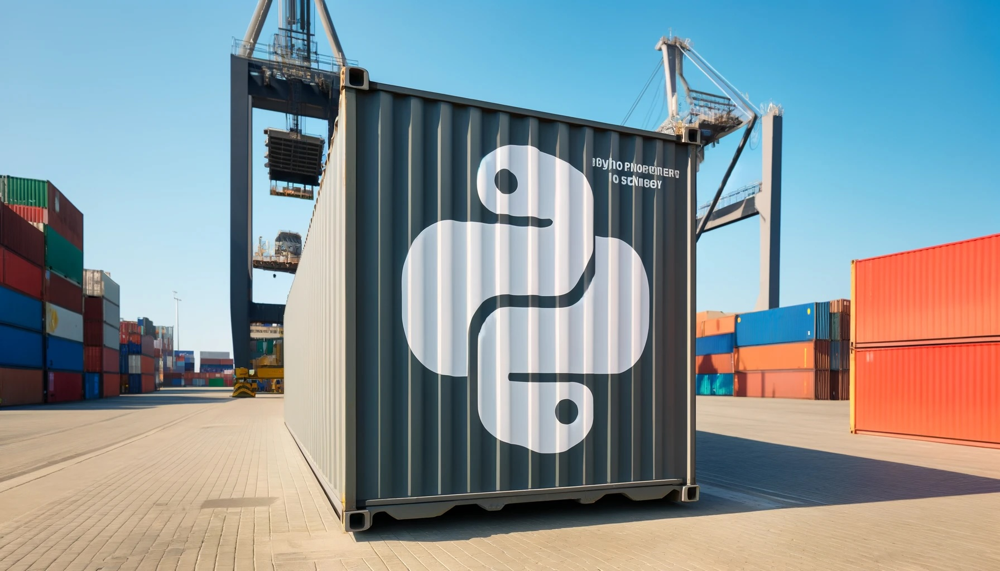

# **Unlock the Power of Dev Containers: Build a Consistent Python Development Environment in Seconds!**
## Thomas Fraunholz
Smart Cyber Security GmbH

---

<div class="columns" style="height: 100%">
<div class="columns-left">

# **How it all began...**
```bash
$ pip install something
```

</div>
<div class="columns-right" >


</div>
</div>

---

<div class="columns" style="height: 100%">
<div class="columns-left">

# **How it all began...**
```bash
$ pip install something
```

</div>
<div class="columns-right">


</div>
</div>

---

<div class="columns" style="height: 100%">
<div class="columns-left">

# **What's the Problem?**

## Virtual Environment

## Python Package Management

## Python Interpreter 

## System Libraries 

</div>
<div class="columns-right">


</div>
</div>

---



---
<div style="height: 100%">

# **Minimalistic DevContainer Setup**
```bash
├── devontainer
│   ├── .devcontainer.json
```
```json
{
	"image": "mcr.microsoft.com/devcontainers/python:1-3.12-bullseye",
	"remoteUser": "vscode"
}
```

</div>

---

<div style="height: 100%">

# **DevContainer Poetry Setup**

```bash
├── devontainer
│   ├── .devcontainer.json
```
```json
{
	"image": "mcr.microsoft.com/devcontainers/python:1-3.12-bullseye",
	"remoteUser": "vscode"
	"postCreateCommand": "pip install poetry && poetry install",
}
```
```bash
├── pyproject.toml
├── poetry.lock
```

</div>

---

<div style="height: 100%">

# **DevContainer Poetry Setup**

```bash
├── devontainer
│   ├── .devcontainer.json
├── pyproject.toml
```

```toml
[tool.poetry.dependencies]
python = ">=3.9,<4.0.0"
fastapi = "^0.110.1"

[tool.poetry.group.dev.dependencies]
pytest = "^7.2.0"
```	

```bash
├── poetry.lock
```

</div>

---

<div style="height: 100%">

# **Git Integration**

```bash
git clone https://<PERSONAL_ACCESS_TOKEN>@github.com/<REPOSITORY>

git clone https://<USERNAME>:<APP_PASSWORD>@bitbucket.org/<REPOSITORY>

git clone https://<TOKEN_NAME>:<PERSONAL_ACCESS_TOKEN>@gitlab.com/<REPOSITORY>
```

</div>

---

<div style="height: 100%">

# **Environment Variables**

```bash
├── devontainer
│   ├── .devcontainer.json
```
```json
{
   ...
   "runArgs": ["--env-file",".env"],
   ...
}
```
```bash
├── pyproject.toml
├── poetry.lock
├── .env
```

</div>

---

<div style="height: 100%">

# **Environment Variables**

```bash
├── devontainer
│   ├── .devcontainer.json
├── pyproject.toml
├── poetry.lock
├── .env
```
```bash
GIT_AUTHOR_NAME=<YOUR_NAME>
GIT_AUTHOR_EMAIL=<YOUR_EMAIL>
GIT_COMMITER_NAME=<YOUR_NAME>
GIT_COMMITER_EMAIL=<YOUR_EMAIL>
```

</div>

---

<div style="height: 100%">

# **Advanced Topics**
- Start services with docker-compose
- CI/CD with devcontainer-cli
- Platform Independent Development

</div>

---


---
# **GPU Setup**


<div style="height: 100%">


```bash
├── devontainer
│   ├── .devcontainer.json
```
```json
{
	"build": {
		"dockerfile": "Dockerfile",
		"context": ".."
	},
	"postCreateCommand": "bash scripts/install-dev-tools.sh",	
	"runArgs": ["--gpus","all", "--shm-size=1gb"],
	"remoteUser": "user",
}
```
```bash
│   ├── Dockerfile
├── pyproject.toml
├── poetry.lock
```

</div>

---
# **GPU Setup**

<div style="height: 100%">

</div>

---
# **GPU Setup**

<div style="height: 100%">

```bash
├── devontainer
│   ├── .devcontainer.json
│   ├── Dockerfile
```
```docker
FROM nvidia/cuda:11.7.1-base-ubuntu22.04 AS base

# Install Python and Poetry
...

# Create User
ARG USER_GID=$USER_UID
RUN groupadd --gid $USER_GID user \
    && useradd --uid 1000 --gid $USER_GID -m user \
    ...
```
```bash
├── pyproject.toml
├── poetry.lock
```
</div>

---
# **GPU Setup**

<div style="height: 100%">

```bash
├── devontainer
│   ├── .devcontainer.json
│   ├── Dockerfile
├── pyproject.toml
```

```toml
[tool.poetry.dependencies]
python = ">=3.9,<4.0.0"
torch = { version = "2.0.1", source="torch"}

[[tool.poetry.source]]
name = "torch"
url = "https://download.pytorch.org/whl/cu118"
priority = "explicit
```

```bash
├── poetry.lock
```

</div>
